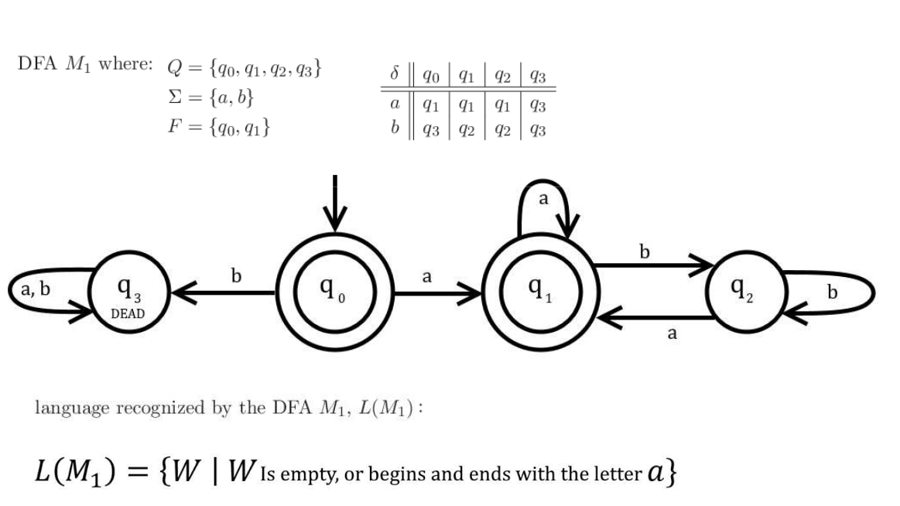

# dfa-gen
A Generic Deterministic Finite-State Automaton Generator Written in Rust

## Example



**Code Represntation**
```rust
use dfagen::DFABuilder;

fn main() {
    let q0 = String::from("q0");
    let q1 = String::from("q1");
    let q2 = String::from("q2");
    let q3 = String::from("q3");

    let mut dfa = DFABuilder::default()
        .add_state(&q0)
        .add_state(&q1)
        .add_state(&q2)
        .add_state(&q3)
        .mark_dead_state(&q3)
        .mark_start_state(&q0)
        .mark_accept_state(&q0)
        .mark_accept_state(&q1)
        .add_transition(&q0, &'a', &q1)
        .add_transition(&q0, &'b', &q3)
        .add_transition(&q1, &'a', &q1)
        .add_transition(&q1, &'b', &q2)
        .add_transition(&q2, &'a', &q1)
        .add_transition(&q2, &'b', &q2)
        .build();

    dbg!(&dfa);

    dbg!(dfa.recognize("".chars()));
    dbg!(dfa.recognize("a".chars()));
    dbg!(dfa.recognize("b".chars()));
    dbg!(dfa.recognize("aa".chars()));
    dbg!(dfa.recognize("ab".chars()));
    dbg!(dfa.recognize("abb".chars()));
    dbg!(dfa.recognize("aba".chars()));
    dbg!(dfa.recognize("abba".chars()));
    dbg!(dfa.recognize("babba".chars()));
}
```

**Output**
```
[src/main.rs:26] &dfa = DFA {
    states: {
        "q0",
        "q1",
        "q2",
        "q3"
    },
    accept_states: {
        "q0"
        "q1",
    },
    dead_states: {
        "q3"
    },
    goal_states: {},
    transitions: {
        'a': {
            "q0": "q1"
            "q1": "q1",
            "q2": "q1",
        },
        'b': {
            "q0": "q3"
            "q1": "q2",
            "q2": "q2",
        }
    },
    start: Some(
        "q0"
    ),
    current: "q0"
}
[src/main.rs:28] dfa.recognize("".chars()) = Accept
[src/main.rs:29] dfa.recognize("a".chars()) = Accept
[src/main.rs:30] dfa.recognize("b".chars()) = Reject
[src/main.rs:31] dfa.recognize("aa".chars()) = Accept
[src/main.rs:32] dfa.recognize("ab".chars()) = Reject
[src/main.rs:33] dfa.recognize("abb".chars()) = Reject
[src/main.rs:34] dfa.recognize("aba".chars()) = Accept
[src/main.rs:35] dfa.recognize("abba".chars()) = Accept
[src/main.rs:36] dfa.recognize("babba".chars()) = Reject
```
